# Website to Dashboard Database Connection Flowchart

Dokumen ini menggambarkan hubungan dari website publik Redline Academy ke halaman login, dashboard berbasis role, lalu ke interface database connection. Pola `Data Repository Interface` di bawah adalah batas konseptual untuk merapikan akses data dari dashboard JavaScript menuju Supabase/PostgreSQL.

```mermaid
flowchart LR
    Visitor(["Visitor / User"])

    subgraph Website["Public Website Layer"]
        Home["Homepage<br/>index.html"]
        PublicPages["Public content pages<br/>about, programs, blog, contact,<br/>articles, legal"]
        PublicRuntime["Public frontend runtime<br/>script.js, main.js, blog-hub.js,<br/>i18n, navigation, public forms"]
        Enrollment["Enrollment / inquiry flows<br/>programs.html, whatsapp-enquiry.html"]
        LoginEntry["LMS / portal entry point<br/>pages/login.html"]

        Home --> PublicPages
        PublicPages --> PublicRuntime
        PublicPages --> Enrollment
        PublicPages --> LoginEntry
    end

    subgraph AuthRouting["Authentication and Dashboard Routing"]
        LoginUI["Login UI<br/>pages/login.html"]
        AuthBoundary["Auth/session boundary<br/>auth.js, guard.js"]
        ProfileLookup["Profile and role lookup<br/>profiles.role, is_active"]
        RoleRouter{"Dashboard role route"}
        StudentDashboard["Student Dashboard<br/>pages/dashboard-student.html<br/>dashboard-student.js"]
        AdminDashboard["Admin / Trainer Dashboard<br/>pages/dashboard-admin.html<br/>dashboard-admin.js"]
        MarketerDashboard["Marketer Dashboard<br/>pages/dashboard-marketer.html<br/>dashboard-marketer.js"]

        LoginUI --> AuthBoundary
        AuthBoundary --> ProfileLookup
        ProfileLookup --> RoleRouter
        RoleRouter -->|"student"| StudentDashboard
        RoleRouter -->|"admin / trainer"| AdminDashboard
        RoleRouter -->|"marketer"| MarketerDashboard
    end

    subgraph RepositoryLayer["Data Repository Interface Layer"]
        Repository["Data Repository Interface<br/>logical dashboard data boundary"]
        ProfileRepo["Profile repository<br/>user profile, role, activation"]
        CourseRepo["Course repository<br/>courses, modules, lessons, materials"]
        AssignmentRepo["Assignment repository<br/>assignments, submissions, grading"]
        MessageRepo["Message repository<br/>threads, messages, notifications"]
        ProgressRepo["Progress repository<br/>lesson completion, course progress,<br/>certificates, dashboard views"]
        StorageRepo["Storage repository<br/>signed URLs and private files"]

        Repository --> ProfileRepo
        Repository --> CourseRepo
        Repository --> AssignmentRepo
        Repository --> MessageRepo
        Repository --> ProgressRepo
        Repository --> StorageRepo
    end

    subgraph Client["Database Client Layer"]
        SupabaseClient["@supabase/supabase-js v2<br/>js/supabase-client.js"]
        QueryMethods["Client API methods<br/>.from(...), .select(), .insert(),<br/>.update(), .delete(), .rpc(), storage.from(...)"]
    end

    subgraph Supabase["Supabase Service Layer"]
        SupabaseAuth["Supabase Auth<br/>sessions and user identity"]
        PostgREST["PostgREST Data API<br/>table and view access"]
        RPC["PostgreSQL RPC<br/>business functions via .rpc(...)"]
        Storage["Supabase Storage<br/>private course materials and files"]
        Realtime["Supabase Realtime<br/>notifications and dashboard refresh"]
    end

    subgraph Database["PostgreSQL Database Layer"]
        Tables["Core LMS tables<br/>profiles, courses, lessons,<br/>assignments, submissions, messages,<br/>notifications, progress"]
        Views["Read models / views<br/>dashboard and progress views"]
        Policies["RLS policies<br/>role-based access control"]
        Functions["SQL functions<br/>progress recalculation and helpers"]
    end

    subgraph PaymentBackend["Server-side Payment and Upload Flow"]
        PHP["Plain PHP endpoints<br/>submit_registration.php, doku_notify.php,<br/>get_csrf_token.php"]
        DOKU["DOKU Checkout API<br/>payment request and webhook"]
        ServerFiles["Server filesystem<br/>private KTP uploads and logs"]
        PaymentSQL["Payment-related SQL setup<br/>SUPABASE_PAYMENTS_SETUP.sql"]
    end

    Visitor --> Home
    LoginEntry --> LoginUI
    Enrollment --> PHP

    StudentDashboard --> Repository
    AdminDashboard --> Repository
    MarketerDashboard --> Repository

    AuthBoundary --> SupabaseClient
    ProfileRepo --> SupabaseClient
    CourseRepo --> SupabaseClient
    AssignmentRepo --> SupabaseClient
    MessageRepo --> SupabaseClient
    ProgressRepo --> SupabaseClient
    StorageRepo --> SupabaseClient

    SupabaseClient --> QueryMethods
    SupabaseClient --> SupabaseAuth
    QueryMethods --> PostgREST
    QueryMethods --> RPC
    QueryMethods --> Storage
    QueryMethods --> Realtime

    PostgREST --> Tables
    PostgREST --> Views
    RPC --> Functions
    Realtime --> Tables
    Storage --> Policies
    Tables --> Policies
    Views --> Policies
    Functions --> Policies

    PHP --> DOKU
    DOKU --> PHP
    PHP --> ServerFiles
    PHP -.optional persistence / setup.-> PaymentSQL
    PaymentSQL -.defines payment tables.-> Tables

    classDef website fill:#e9f5ff,stroke:#2c6e9b,color:#17384d
    classDef frontend fill:#e9f5ff,stroke:#2c6e9b,color:#17384d
    classDef boundary fill:#fff4db,stroke:#b7791f,color:#4a2d05
    classDef client fill:#f3edff,stroke:#7c3aed,color:#32135f
    classDef service fill:#eafaf1,stroke:#2f855a,color:#123524
    classDef database fill:#fdecec,stroke:#b84a4a,color:#4a1818
    classDef backend fill:#f5f1e8,stroke:#7a5c2e,color:#2e2416

    class Visitor,Home,PublicPages,PublicRuntime,Enrollment,LoginEntry website
    class LoginUI,AuthBoundary,ProfileLookup,RoleRouter,StudentDashboard,AdminDashboard,MarketerDashboard frontend
    class Repository,ProfileRepo,CourseRepo,AssignmentRepo,MessageRepo,ProgressRepo,StorageRepo boundary
    class SupabaseClient,QueryMethods client
    class SupabaseAuth,PostgREST,RPC,Storage,Realtime service
    class Tables,Views,Policies,Functions database
    class PHP,DOKU,ServerFiles,PaymentSQL backend
```

## Technologies Used

### Website and Dashboard

- HTML pages: `index.html` and `pages/*.html`.
- CSS: `styles/*.css` and `css/*.css`.
- Frontend runtime: vanilla JavaScript modules in `js/` and `scripts/`.
- Public website features: navigation, multilingual content, blog/article pages, program pages, contact/inquiry flows.
- Dashboard pages: `dashboard-student.html`, `dashboard-admin.html`, and `dashboard-marketer.html`.

### Database Connection Interface

- Repository boundary: conceptual `Data Repository Interface` for profile, course, assignment, message, progress, notification, and storage access.
- Supabase client: `@supabase/supabase-js` v2.
- Shared client file: `js/supabase-client.js` and related dashboard imports/usages.
- Query APIs: `.from(...)`, `.select()`, `.insert()`, `.update()`, `.delete()`, `.rpc(...)`, and `storage.from(...)`.

### Auth, Database, and Storage

- Authentication: Supabase Auth.
- Authorization: PostgreSQL Row Level Security policies.
- Database platform: Supabase.
- Database engine: PostgreSQL.
- Data API: Supabase PostgREST.
- RPC/business logic: PostgreSQL functions called through Supabase `.rpc(...)`.
- Realtime: Supabase Realtime for notification/dashboard refresh flows.
- Storage: Supabase Storage for LMS files and private course materials.

### Server-side Payment Flow

- Server endpoints: plain PHP files such as `submit_registration.php`, `doku_notify.php`, and `get_csrf_token.php`.
- Payment provider: DOKU Checkout API.
- Upload/log storage: server filesystem for selected private uploads and webhook logs.
- SQL setup: `SUPABASE_PAYMENTS_SETUP.sql` and other `SUPABASE_*.sql` files for schema, policies, and functions.

### Testing and Tooling

- Runtime/tooling: Node.js.
- QA/testing: Playwright and Jest.
- Code quality: ESLint and Prettier.
- Supabase tooling: Supabase CLI dependency.
